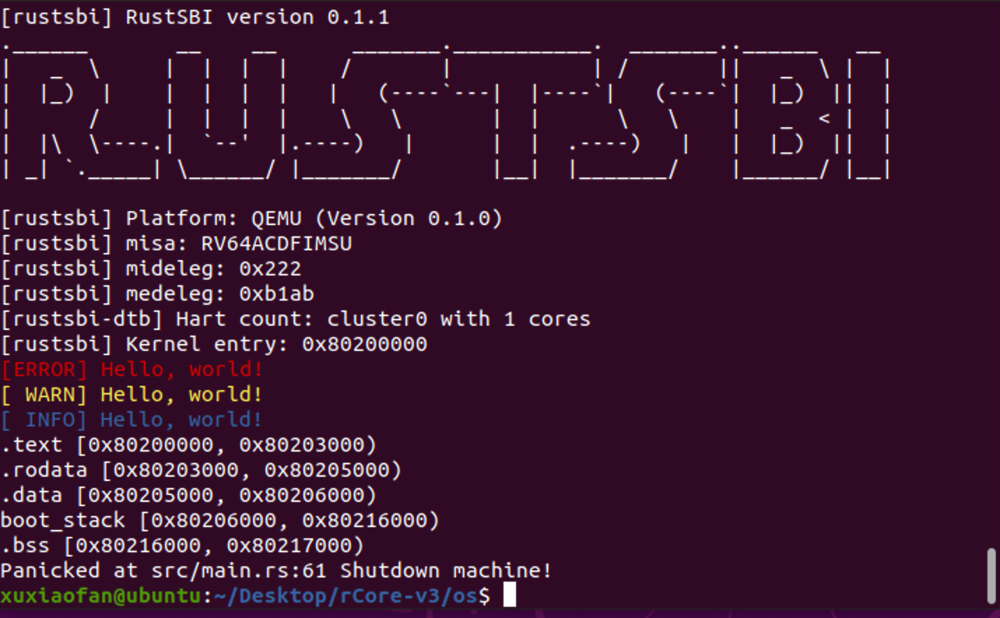
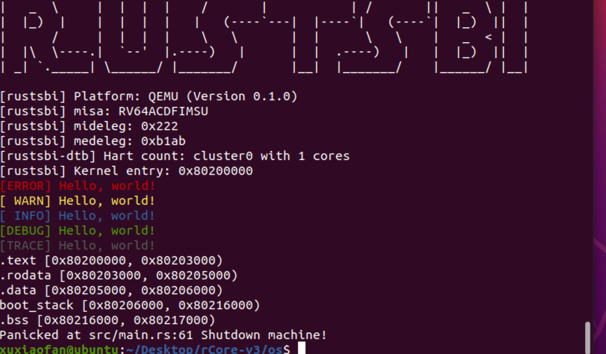

# Lab 1 实验报告

## 一、编程内容

1. 在`console`模块中添加`print_in_color`方法，支持给定`color_code`进行彩色输出；
2. 创建`logger`模块，在该模块中创建`SimpleLogger`结构体实现`log` crate 中的`Log` Trait ，并编写初始化函数，使得其他模块可以直接调用`log` crate 中的相应宏进行不同等级的输出；
3. 在 Makefile 中添加`LOG`环境变量，使用户可以自行设定输出等级范围；
4. 在`main`模块的`rust_main`函数中进行`logger`初始化，并调用`info!`, `error!`等宏进行测试。

## 二、测试截图

1. 终端指令：
    make run

默认`LOG=INFO`，因此只输出优先等级高于或等于 info 的信息。

2. 终端指令：
    make run LOG=TRACE

用户指定`LOG=TRACE`，输出优先等级高于或等于 trace 的信息。

## 三、问答题目

1. 寄存器`mideleg`记录了机器中断委托信息，寄存器`medeleg`记录了机器同步异常委托信息。rustsbi 委托的机器中断为`sext`, `stimer` 及 `ssoft`，委托的同步异常为`instruction_misaligned`, `breakpoint`, `user_env_call`, `instruction_page_fault`, `load_page_fault`, `store_page_fault`, `instruction_fault`, `load_fault` 及 'store_fault`。

2. qemu 启动入口位于地址`0x00001000`，运行几条指令后跳转至地址`0x80000000`，即 rustsbi 起始代码`start`的入口，之后跳转至 rustsbi 的`main`函数；进行一系列初始化操作后将`mepc`寄存器的值设为`s_mode_start`，将`mstatus`寄存器的值设为`Supervisor`模式，并调用`enter_privileged`函数，利用`mret`指令跳转至`s_mode_start`，且此时权限为S模式；最后在`s_mode_start`函数中跳转至地址`0x80200000`。
